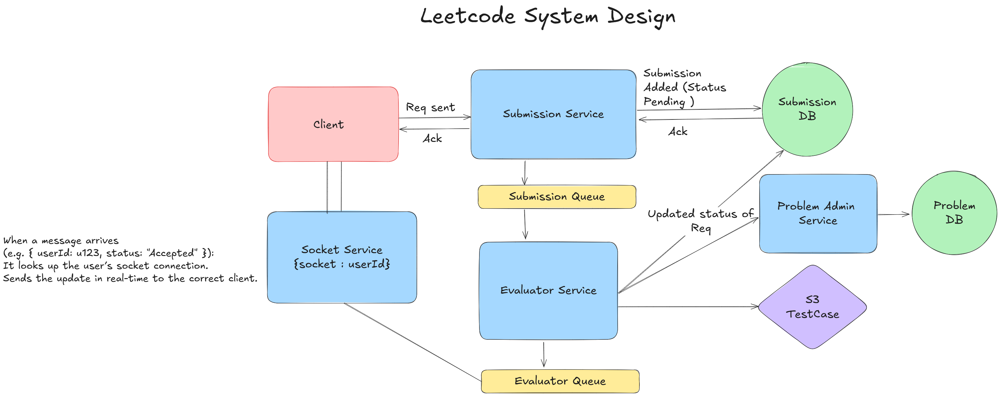

# 🚀 Leethub Microservices

A high-performance **LeetCode-style online judge** built with a **decoupled microservices architecture**, designed for **speed, scalability, and reliability**. Handles 100+ submissions per minute and provides **real-time updates** on code execution. 💻⚡

---

## ✨ Features

* **Decoupled Microservices:** Modular backend for easy maintenance and scaling. 🛠️
* **Asynchronous & Synchronous Communication:** Handles multiple submissions efficiently with queue-based async pipelines and direct sync calls where needed. ⏱️
* **Secure Docker Sandboxing:** Runs Python, Java, and C++ safely in isolated containers. 🐳
* **Redis Caching & Queue Management:** Optimizes throughput and reduces response time. ⚡
* **Real-Time Updates:** Socket.IO reduces perceived latency by 70%. 📡
* **Optimized Worker Services:** ~95% faster code evaluation. 🚀

---

## 🛠️ Tech Stack

* **Backend:** Node.js, Express
* **Real-Time:** Socket.IO
* **Caching/Queue:** Redis
* **Containers:** Docker, Docker Compose
* **Languages:** Python, Java, C++

---

## 🏗️ Microservices Overview

| Service Name   | Responsibility                                                            |
| -------------- | ------------------------------------------------------------------------- |
| **Submission** | Receives user submissions and pushes them to the queue for evaluation. 📨 |
| **Evaluator**  | Executes code in Docker sandboxes, returns results to the queue. 🐳       |
| **Problem**    | Manages problem definitions, test cases, and submission validation. 📚    |
| **Socket**     | Sends real-time status updates to clients via WebSocket connections. 📡   |

---

## 🖼️ System Design



The system is structured into **independent services** connected through asynchronous pipelines and Redis. Each service can scale independently to handle high submission loads efficiently. ⚡

---

## 🎯 Goal

Provide a **robust, scalable online judge** suitable for **learning, competitive coding, and real-world assessments**. 🏆

---

## ⚙️ Setup & Installation

### 1️⃣ Clone the Repositories

Ensure all microservices and frontend are in your workspace.

```bash
git clone https://github.com/yourusername/leethub-microservices.git
```

### 2️⃣ Environment Variables

Create a `.env` file in each service directory based on requirements.

**Frontend (leetcode-clone-nextjs):**

```
DATABASE_URL="postgresql://..."
NEXT_PUBLIC_CLERK_PUBLISHABLE_KEY="..."
CLERK_SECRET_KEY="..."
```

**Problem Service:**

```
PORT=3002
MONGODB_URI="mongodb://..."
```

**Submission Service:**

```
PORT=3005
MONGODB_URI="mongodb://..."
REDIS_HOST="localhost"
REDIS_PORT=6379
```

**Evaluator Service:**

```
REDIS_HOST="localhost"
REDIS_PORT=6379
```

**Socket Service:**

```
PORT=3004
REDIS_HOST="localhost"
REDIS_PORT=6379
```

### 3️⃣ Install Dependencies

```bash
npm install
```

Run this in each service directory.

### 4️⃣ Start the Services

Run all services concurrently for full functionality:

```bash
# In each service directory
npm run dev
```

### 🧪 Running a Test

1. Sign in via the Frontend.
2. Navigate to a problem or create a new one using the Create Problem UI.
3. Write your solution in the code editor.
4. Click **Run** to test or **Submit** for full evaluation.
5. Watch real-time updates via the Socket Service! ⚡

### 🛡️ Security

User code is executed in **isolated Docker containers** with limited resources and no network access to prevent malicious activity. 🔒

---

## 📄 License
This project is licensed under the ISC License.

This project is licensed under the ISC License.
